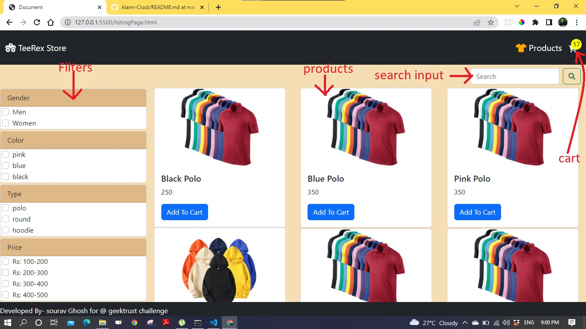
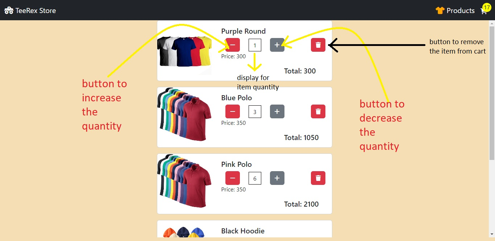

TeeRex Store

# TeeRex Store
User can add T-Shirt to cart and remove it. Filter and Search for Tshirt.

## Tech Stack:
- HTML, CSS
- JavaScript

## Features
* Consists a cart where user can add and remove Tshirt, increase and decrease quantity;
* User can Filter Tshirts by type, price, color and gender
* User can search by type, name or color

# Directory Structure

```
├── README.md
├── cartPage.css        
├── cartPage.html       
├── cartPage.js
├── filter.js
├── listingPage.html    
├── listingPage.js      
├── listingPageStyle.css
└── search.js

```
## Features with details
<ol>
 <li><h3>Listing page</h3>
 <ul>
    <li>
    
    </li>
 </ul>
 </li>
  <li><h3>Cart Page</h3>
 <ul>
    <li>
    
    </li>

 </ul>
 </li>

</ol>

  
## Git Clone
To use this repository in your local system-

<a href="https://github.com/CoderOnTheRoad/TeeRex-Store.git" target="_blank">https://github.com/CoderOnTheRoad/TeeRex-Store.git </a>

or run this command in your GitHub CLI

###### `gh repo clone CoderOnTheRoad/TeeRex-Store`
<br>


## <a href = "https://coderontheroad.github.io/TeeRex-Store/listingPage" target="_blank"> Demo / Hosted on - https://coderontheroad.github.io/TeeRex-Store/listingPage </a>